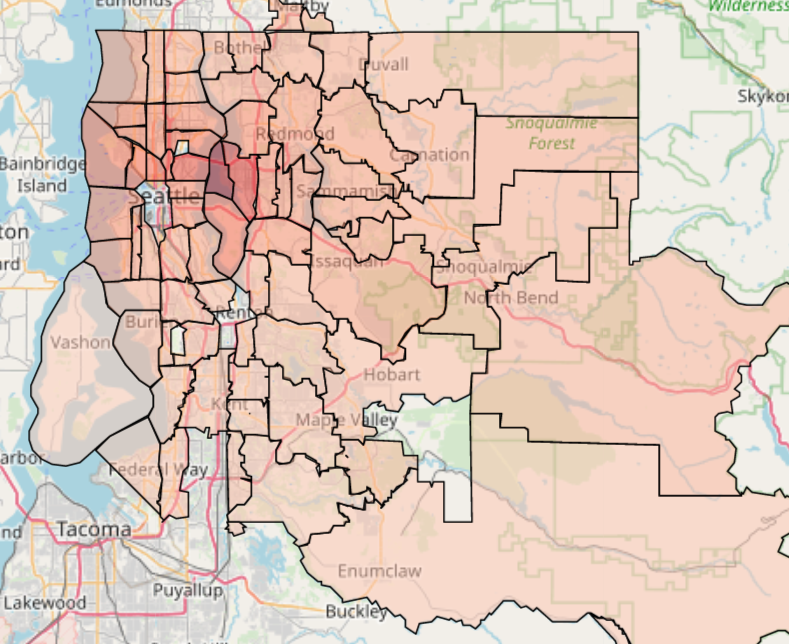
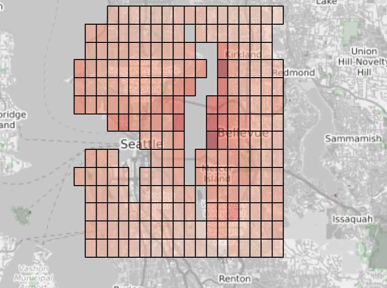

# Module 2 Final Project

## The Goal

The goal of this project is to create a multiple linear regression model that accurately predicts house prices in King County, WA.

# Notebook Setup
For this project I used general python libraries, geomapping libraries, and statistical or regression libraries.

## General python libraries
* import json
* import matplotlib.pyplot as plt
* import numpy as np
* import pandas as pd
* import pickle
* import re

## Geo mapping libraries
* from branca.colormap import linear
* import geopandas as gpd
* from ipyleaflet import Map, GeoData, basemaps, LayersControl, Choropleth, Heatmap, FullScreenControl
* from ipyleaflet import WidgetControl, GeoJSON 
* from ipywidgets import Text, HTML
* from shapely.geometry import Point, Polygon

## Statistics and regression libraries
* from scipy.stats import zscore
* from sklearn.linear_model import LinearRegression
* from sklearn.metrics import mean_squared_error
* from sklearn.model_selection import cross_val_score
* from sklearn.preprocessing import minmax_scale
* import statsmodels.api as sm
* import statsmodels.stats.api as sms

# My Approach
* Use pandas to initially ingest the datasets and clean them, fill missing values, correct data types, convert certain columns to binary, remove outliers, bin and one-hot encode columns
* Use Sklearn to create baseline model at this point (.954 R-squared)
* Then use numpy to log-transform features
* Min-max scale features using Sklearn
* Remove features that weren't statistically significant
* Rerun model after changes (.949 R-squared)
* Validate model with k-fold cross validation (10 folds, using negative mean squared error with result of -17.06e9)
* Pickle the model for portability

# After creating model, investigate zipcode feature and try new approach
A property's location, encoded by zipcode, is the most important feature in the dataset but zipcodes are of an arbitrary shape, the government changes them and they are also too big for more detailed location-based analysis.

See how various the zipcodes' sizes and shapes are:

## Create new feature called a "geobin"
Because zipcodes are so unreliable, I split the data into many smaller "geobins". These polygons are based on latitude and longitude, are much smaller than the zipcode data that was provided and will allow us to differentiate between different locations' affect on price more accurately. 

# Conclusion
Our final geobins-based model had the same r-squared as the original zipcode model but also has the advantage of using a location feature that is standardized, scalable, and not arbitrary.
